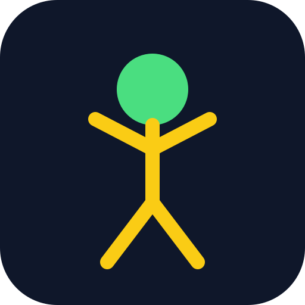

# حرکت‌سنج (Motion Tracker)

<div align="center">
  
  
  **اپلیکیشن وب پیشرفته برای آنالیز حرکت و اندازه‌گیری عملکرد ورزشی**
  
  [](LICENSE)
  []()
  []()
</div>

---

## 📱 ویژگی‌ها

### 🏃 حالت دویدن (Run Mode)
- تشخیص خودکار عبور از موانع با استفاده از هوش مصنوعی
- اندازه‌گیری زمان دقیق با کالیبراسیون دو نقطه‌ای
- محاسبه سرعت بر حسب متر بر ثانیه
- ذخیره خودکار نتایج در تاریخچه

### ⤴️ حالت پرش (Jump Mode)
- کالیبراسیون خودکار ارتفاع پایه
- تشخیص زمان پرواز با دقت بالا
- محاسبه ارتفاع پرش بر اساس فرمول فیزیکی
- نمایش نتایج به صورت سانتی‌متر

### 📊 سیستم تاریخچه
- ذخیره آخرین ۵۰ اندازه‌گیری
- نمایش تاریخ و ساعت فارسی
- امکان پاک کردن تاریخچه
- ذخیره‌سازی در localStorage

### ⚙️ تنظیمات پیشرفته
- تنظیم حساسیت تشخیص پرش
- تنظیم حساسیت تشخیص فرود
- تنظیم تعداد فریم‌های کالیبراسیون
- ذخیره تنظیمات کاربر

### 🎨 رابط کاربری
- طراحی واکنش‌گرا (Responsive)
- پشتیبانی از حالت Portrait و Landscape
- رابط کاربری فارسی با RTL
- سازگار با گوشی‌های کوچک

---

## 🚀 نحوه استفاده

### نصب به عنوان PWA
1. سایت رو در مرورگر گوشی باز کنید
2. از منوی مرورگر گزینه "Add to Home Screen" رو انتخاب کنید
3. اپلیکیشن نصب می‌شه و آیکون اون روی صفحه اصلی نمایش داده می‌شه

### استفاده از حالت دویدن
1. دکمه "شروع" رو بزنید و دسترسی دوربین رو تأیید کنید
2. روی نقطه اولین مانع ضربه بزنید
3. روی نقطه دومین مانع ضربه بزنید
4. فاصله واقعی بین دو مانع رو وارد کنید
5. از کنار یکی از موانع رد شوید تا زمان‌سنجی شروع شود
6. نتایج رو مشاهده کنید

### استفاده از حالت پرش
1. به حالت پرش سوئیچ کنید
2. صاف و بی‌حرکت بایستید تا کالیبراسیون انجام شود
3. بپرید! سیستم به صورت خودکار زمان پرواز رو ثبت می‌کنه
4. ارتفاع پرش رو مشاهده کنید

---

## 🛠️ تکنولوژی‌ها

- **TensorFlow.js 4.20.0** - پردازش مدل‌های ML
- **BlazePose** - تشخیص نقاط کلیدی بدن
- **MediaPipe** - پردازش ویدیو
- **Service Worker** - قابلیت کار آفلاین
- **Progressive Web App** - نصب روی دستگاه

### نقاط کلیدی ردیابی شده
- شانه‌ها (Shoulders)
- آرنج‌ها (Elbows)
- مچ دست (Wrists)
- لگن (Hips)
- زانوها (Knees)
- قوزک پا (Ankles)

---

## 📁 ساختار پروژه

```
motion-tracker/
├── index.html          # صفحه اصلی HTML
├── app.js              # منطق اصلی برنامه
├── manifest.json       # تنظیمات PWA
├── sw.js              # Service Worker
├── icon.svg           # آیکون برنامه
├── README.md          # مستندات
└── .gitignore         # فایل‌های نادیده گرفته شده
```

---

## 🔬 فرمول‌ها

### محاسبه ارتفاع پرش
```
h = (g × t²) / 8

where:
  h = ارتفاع پرش (متر)
  g = شتاب گرانش (9.81 m/s²)
  t = زمان پرواز (ثانیه)
```

### محاسبه سرعت دویدن
```
v = d / t

where:
  v = سرعت (m/s)
  d = فاصله (متر)
  t = زمان (ثانیه)
```

---

## 🎯 دقت و حساسیت

- تشخیص نقاط کلیدی با دقت > 90%
- محاسبه زمان با دقت میلی‌ثانیه
- قابل تنظیم برای شرایط مختلف نوری
- فیلترینگ نویز با Debounce

---

## 📱 سازگاری

- ✅ Chrome (Desktop & Mobile)
- ✅ Safari (iOS & macOS)
- ✅ Firefox
- ✅ Edge
- ✅ Samsung Internet

---

## 🔒 حریم خصوصی

- تمام پردازش‌ها روی دستگاه انجام می‌شه
- هیچ تصویری به سرور ارسال نمی‌شه
- داده‌ها فقط در localStorage دستگاه ذخیره می‌شن

---

## 📄 مجوز

این پروژه تحت مجوز MIT منتشر شده است.

---

## 👤 نویسنده

**mahtdy**
- GitHub: [@mahtdy](https://github.com/mahtdy)

---

## 🙏 تشکر از

- TensorFlow.js Team
- MediaPipe
- BlazePose Model

---

<div align="center">
  ساخته شده با ❤️ برای ورزشکاران ایرانی
</div>
